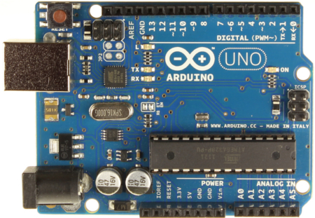
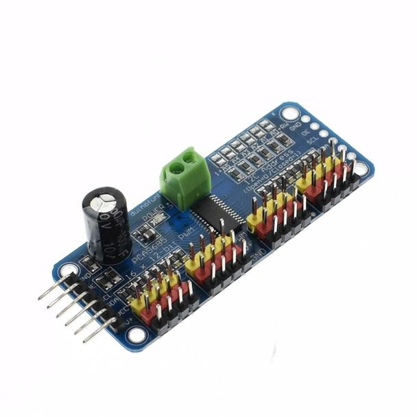

# arduino-sainsmart

[Arduino][1] software to steer the SainSmart [DIY 6-axis palletizing robot arm][2] and [Sunfounder Rollpaw gripper][15].


The software uses smooth *sin²(t)* (where t is the time) speed profiles to drive the robot joints.
At any time the sum of up to two speed profiles is output to the drives.
Using *sin²(t)+cos²(t)=1* one can achieve constant motion.
The plot shows jerk (blue), acceleration (red), speed (green), and position (magenta).


## equipment

[][2]

[][5]

[][4]

[][6]

[][17]

[][15]

Altogether the equipment cost is about 200$.
Furthermore you need a PC with a USB port.

## software build

First install the dependencies. Please follow these steps:

sudo: required
dist: xenial
languge: c
compiler: 
* gcc

Before install:
```
sudo apt-get install arduino-mk
sudo apt-get install arduino
````

PCA9685 library install:
```
git clone https://github.com/adafruit/Adafruit-PWM-Servo-Driver-Library
```
and rename the folder to *Adafruit_PWMServoDriver*

Then open Arduino IDE and go to Sketch > Import Library > Add Library > Choose the folder *Adafruit_PWMServoDriver*

Build the Arduino program using *make*:

```
make
```

Note: You might have to change the *BOARD_TAG* in the *Makefile*.
See */usr/share/arduino/hardware/arduino/boards.txt* for supported board tags.

## install on Arduino

The upload target will upload the program via */dev/ttyACM0* to the *Arduino* board.

```
make upload
```

**Warning: program the board before connecting the servos the first time to prevent erratic motion!**

**Warning: once servos are plugged into the board, always connect the servo power to the PCA9685 Servo Driver before connecting the USB cable to the Arduino to prevent the board power from stalling which causes erratic motion!**

**Warning: self-collisions or collisions with the surface and other objects can damage the servos!**

You can then adjust the limits and offsets for your robot and then compile and upload the modified software.

## control robot

You can control the robot using the *screen* serial terminal (make sure *ttyUSB0* is the correct port):

```
screen /dev/ttyUSB0 115200
```

Examples of servo commands are:

* **o**: check whether drives are ready to receive more commands (1=ready, 0=busy)
* **t**: get time
* **b**: get base servo angle
* **s**: get shoulder servo angle
* **e**: get elbow servo angle
* **r**: get roll servo angle
* **p**: get pitch servo angle
* **w**: get wrist servo angle
* **g**: get gripper servo angle
* **B**: get base servo pulse width
* **S**: get shoulder servo pulse width
* **E**: get elbow servo pulse width
* **R**: get roll servo pulse width
* **P**: get pitch servo pulse width
* **W**: get wrist servo pulse width
* **G**: get gripper servo pulse width
* **c**: get current configuration (base, shoulder, elbow, roll, pitch, and wrist)
* **l**: get lower limits for servos
* **u**: get upper limits for servos
* **45b**: set base servo angle to 45 degrees
* **-12.5s**: set shoulder servo angle to -12.5 degrees
* **10e**: set elbow servo angle to 10 degrees
* **20r**: set roll servo angle to 20 degrees
* **30p**: set pitch servo angle to 30 degrees
* **40w**: set wrist servo angle to 40 degrees
* **0g**: set gripper servo angle to 0 degrees
* **2400B**: set base servo pulse width to 2400
* **1500S**: set shoulder servo pulse width to 1500
* **720E**: set elbow servo pulse width to 720
* **1500R**: set roll servo pulse width to 1500
* **1500P**: set pitch servo pulse width to 1500
* **1500W**: set wrist servo pulse width to 1500
* **2000G**: set gripper servo pulse width to 2000
* **1 2 3 4 5 6c**: set configuration (base, shoulder, elbow, roll, pitch, and wrist) to 1, 2, 3, 4, 5, and 6 degrees
* **1 2 3 4 5 6t**: time required to reach the specified configuration
* **T**: report time required to finish current motion
* **ma**: save teach point *a* (there are 12 teach points from *a* to *l*)
* **'a**: go to teach point *a*
* **da**: display configuration of teach point *a*
* **x**: stop all servos (in fact any undefined key should do)

You can exit the *screen* terminal using Ctrl-A \\.

**Warning: self-collisions of the robot can damage the servos!**

# External links

* [Sainsmart DIY 6-axis palletizing robot arm][2] (also see [Sainsmart Wiki][11])
* [Sunfounder Standard Gripper Kit Rollpaw for Robotic Arm][15] ([gripper installation instructions][16])
* [Arduino Uno][5] ([Arduino][1] compatible board)
* [PCA9685 Servo Driver for Arduino][4] ([manual][18])
* [6V DC/3A power supply][6]
* [Towerpro MG996R servo][8] (comes with Sainsmart robot)
* [Towerpro SG90 9g servo][9] (comes with Sainsmart robot; servo shaft not compatible with Sunfounder Rollpaw servos!)
* [22 AWG RC JR Servo Straight Extension Wire 150mm][17]
* [Arduino multitasking part 1][12], [part 2][13], [part 3][14]

[1]: https://www.arduino.cc/
[2]: https://www.sainsmart.com/products/6-axis-desktop-robotic-arm-assembled
[4]: https://www.adafruit.com/product/815
[5]: https://learn.sparkfun.com/tutorials/redboard-vs-uno
[6]: http://uk.rs-online.com/web/p/plug-in-power-supply/7424762/
[8]: http://www.hobbyking.com/hobbyking/store/__6221__Towerpro_MG996R_10kg_Servo_10kg_0_20sec_55g.html
[9]: http://www.servodatabase.com/servo/towerpro/sg90
[11]: http://wiki.sainsmart.com/index.php/DIY_6-Axis_Servos_Control_Palletizing_Robot_Arm_Model_for_Arduino_UNO_MEGA2560
[12]: https://learn.adafruit.com/multi-tasking-the-arduino-part-1/
[13]: https://learn.adafruit.com/multi-tasking-the-arduino-part-2/
[14]: https://learn.adafruit.com/multi-tasking-the-arduino-part-3/
[15]: https://www.sunfounder.com/rollpaw.html
[16]: https://www.sunfounder.com/learn/category/Standard-Gripper-Kit-Rollpaw.html
[17]: https://www.amazon.co.uk/d/B00P1716VO
[18]: https://learn.adafruit.com/16-channel-pwm-servo-driver?view=all
